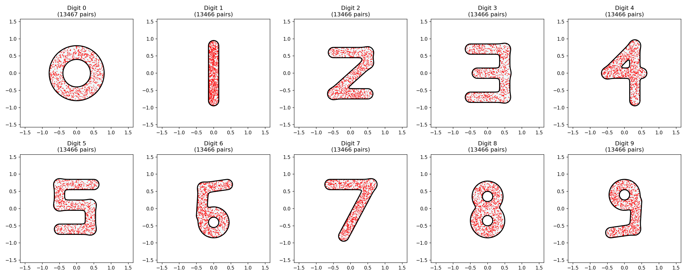

# MNIST Weight-Constrained Neural Network

A JAX/Flax implementation of an MNIST classifier where weights are geometrically constrained to the shapes of the digits 0-9.

I put this together with the help of Gemini 3 in approximately 20 minutes.

## Learned Weights

<p align="center">
  
</p>

## Overview

The network's weights are partitioned into 10 groups. Each group is constrained to a non-convex 2D region (a "bold" digit) using:
- **Smooth Signed Distance Functions (SDFs)** for digit shapes (0-9).
- **Augmented Lagrangian Method (ALM)** to enforce the "weight in digit" inequality constraint.
- **JAX/Flax** for automatic differentiation through the geometric primitives.

## Usage

Using `uv`, you can run the training and visualization directly:

### 1. Train the Network
```bash
uv run train.py
```
This will:
- Download the MNIST dataset.
- Partition the model weights.
- Perform constrained optimization via ALM.
- Save `final_params.npy` and `partition.npz`.

### 2. Visualize the Constrained Weights
```bash
uv run visualize.py
```
This will generate `constrained_weights.png`, showing the 10 groups of weight pairs overlaid on their target digit contours.

## Files
- `geometry.py`: Smooth SDF digit definitions and primitives.
- `alm.py`: Augmented Lagrangian penalty and multiplier update logic.
- `data_loader.py`: Dependency-free MNIST loader.
- `train.py`: Main JAX/Flax training loop.
- `visualize.py`: Script to generate weight distribution plots.
